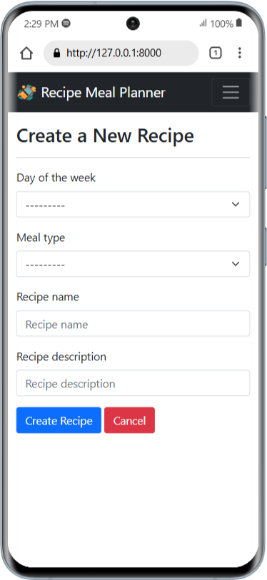

# Recipe Meal Planner
Recipe Meal Planner is a Django based application where users can sign up to create, update, and delete personalized meal plans. The app features the ability to generate and download meal plans as PDFs, making it an efficient tool for meal organization. It also integrates a Razorpay payment gateway to enable users to contribute donations.

## Features
- User registration and login functionality
- Meal plan creation, update, and deletion
- Prevents duplicate entries by restricting recipe creation for an already existing day of the week and meal type
- Meal plan generation and download as PDF
- Razorpay payment gateway integration for donations
- Admin can view all users meal plan

## Login
- Project URL       :   https://recipe-meal-planner-stb.vercel.app/
- Username  :   testuser
- Password  :   test_12345

## Installing
### Clone the project

```bash
git clone https://github.com/shivatejaburle/recipe-meal-planner
cd recipe-meal-planner
```

### Setup your Virtual Environment
```bash
pip install virtualenv
virtualenv venv
# For Windows
venv\Scripts\activate   
# For Mac
source venv/bin/activate 
```

### Install dependencies
```bash
pip install -r requirements.txt
```

### Environment Settings

Get your API Key from Razorpay: https://www.razorpay.com

Create `recipe-meal-planner/.env` to store API Keys.

```bash
# Email Configurations
EMAIL_BACKEND = '<django.core.mail.backends.smtp.EmailBackend>'
EMAIL_HOST = '<YOUR_SMTP_HOST>'
EMAIL_PORT = <YOUR_PORT_NUMBER>
EMAIL_USE_TLS = <True_OR_False>
EMAIL_HOST_USER = '<YOUR_EMAIL_ADDRESS>'
EMAIL_HOST_PASSWORD = '<YOUR_PASSWORD>'

# Razorpay
RAZOR_KEY_ID = '<YOUR_RAZOR_KEY_ID>'
RAZOR_KEY_SECRET = '<YOUR_RAZOR_KEY_SECRET>'
```

### Collect static files (only on a Production Server)

```bash
python manage.py collectstatic
```

### Running a Development Server

Just run this command:

```bash
python manage.py runserver
```
Your application will be available @ http://127.0.0.1:8000/

## Screenshots


### Admin Home

### User Home


### Mobile Screenshots
&emsp; &emsp;&emsp;&emsp; 
&emsp; &emsp;&emsp;&emsp; 